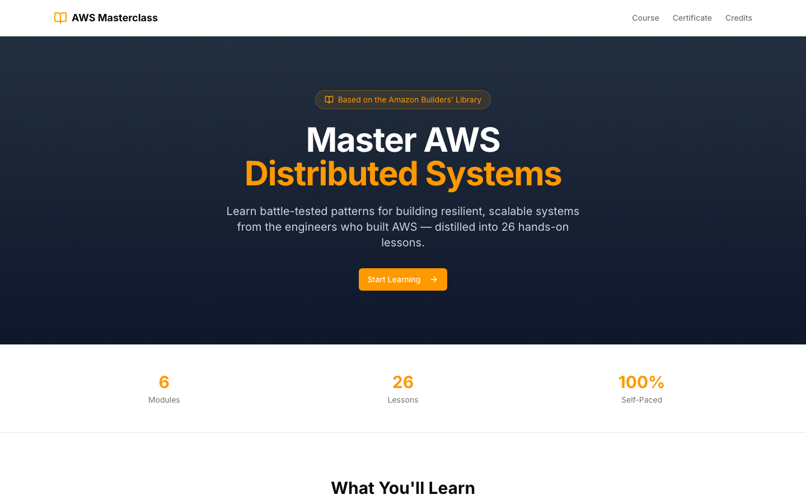

# AWS Distributed Systems Masterclass

A self-paced, interactive web course distilling **26 articles from the Amazon Builders' Library** into 6 modules on resilience, fault isolation, traffic management, deployments, and observability.



## Features

- **26 MDX lessons** across 6 modules — Foundations, Fault Isolation, Traffic Management, Service Dependencies, Safe Deployments, Observability
- **Per-lesson quizzes** with explanations (JSON-driven, 3–5 questions each)
- **Interactive components** — circuit breaker, exponential backoff, shuffle-sharding, multi-AZ topology, queue simulator, deployment simulator, failure cascade, and more
- **Mermaid diagrams** for architecture patterns
- **Progress tracking** via `localStorage` (completed lessons, quiz scores)
- **Dark/light theme** toggle
- **Certificate page** on completion
- **Docker-deployable** as a standalone Next.js production build

## Tech Stack

| Layer        | Choice |
|--------------|--------|
| Framework    | Next.js 15 (App Router, standalone output) |
| Language     | TypeScript |
| Styling      | Tailwind CSS v4 + shadcn/ui (Radix primitives) |
| Content      | MDX via `next-mdx-remote`, GFM enabled |
| Animations   | Framer Motion |
| Diagrams     | Mermaid.js |
| Icons        | lucide-react |

## Prerequisites

- [Node.js](https://nodejs.org/) v20+
- npm v10+ (or Docker, if you prefer the containerised path)

## Local Development

```bash
npm install
npm run dev
```

Open [http://localhost:3000](http://localhost:3000). Hot-reload is enabled.

## Production Build

```bash
npm run build
npm start
```

## Docker

### Docker Compose (recommended)

```bash
docker compose up --build       # foreground
docker compose up --build -d    # detached
docker compose down             # stop
```

App is served at [http://localhost:3000](http://localhost:3000).

### launch.sh (single-container helper)

```bash
./launch.sh                     # builds image, removes prior container, runs detached
PORT=4000 ./launch.sh           # override the host port
docker logs -f aws-course
docker rm -f aws-course
```

### Manual Docker

```bash
docker build -t aws-course .
docker run -p 3000:3000 aws-course
```

The `Dockerfile` is a multi-stage build (`deps → builder → runner`) producing a slim Node 20 Alpine image based on Next.js [standalone output](https://nextjs.org/docs/app/api-reference/config/next-config-js/output).

## Project Structure

```
.
├── content/
│   ├── course.json              # course metadata: modules, lessons, ordering
│   ├── modules/<module>/        # 26 MDX lesson files
│   └── quizzes/<lesson>.json    # per-lesson quiz data
├── src/
│   ├── app/                     # Next.js routes
│   │   ├── page.tsx             # landing
│   │   ├── course/              # /course dashboard + dynamic lesson route
│   │   ├── certificate/
│   │   └── credits/
│   ├── components/
│   │   ├── ui/                  # shadcn primitives
│   │   ├── interactive/         # simulators referenced inside MDX
│   │   ├── lesson-content.tsx   # MDX renderer
│   │   ├── quiz.tsx
│   │   └── mermaid-diagram.tsx
│   └── lib/
│       ├── course-data.ts       # loads course.json + MDX
│       ├── progress.ts          # localStorage progress API
│       └── utils.ts
├── public/                      # static assets (incl. screenshot)
├── Dockerfile
├── docker-compose.yml
├── launch.sh
└── next.config.ts               # output: "standalone"
```

## Authoring Content

To add or edit a lesson:

1. Update `content/course.json` — add the lesson under the appropriate module with `id`, `title`, `slug`, `description`, and `estimatedMinutes`.
2. Create `content/modules/<module-slug>/<lesson-slug>.mdx` with the lesson body. Interactive components from `src/components/interactive/` can be imported and embedded inline.
3. Create `content/quizzes/<lesson-slug>.json` with 3–5 questions. Each question has `question`, `options`, `correctIndex`, and `explanation`.

Mermaid diagrams render via the `<MermaidDiagram />` component inside MDX.

## Progress Tracking

Lesson completion and quiz scores are persisted in `localStorage` under the `aws-course-progress` key. To reset: open DevTools → Application → Local Storage → remove the key, or clear site data.

## Scripts

| Command | Description |
|---------|-------------|
| `npm run dev`   | Dev server with hot reload |
| `npm run build` | Production build (emits `.next/standalone`) |
| `npm start`     | Serve the production build |
| `npm run lint`  | ESLint |

## Credits

Course content is based on the [Amazon Builders' Library](https://aws.amazon.com/builders-library/). See [/credits](http://localhost:3000/credits) for full attribution to the original Amazon authors.
